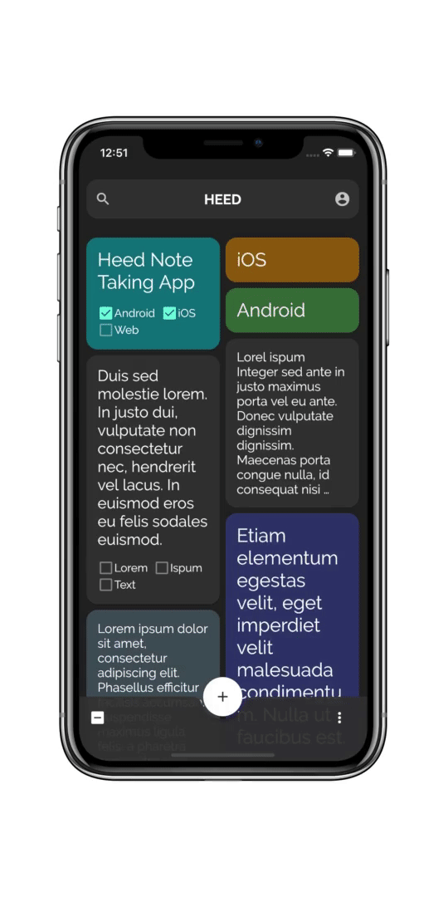
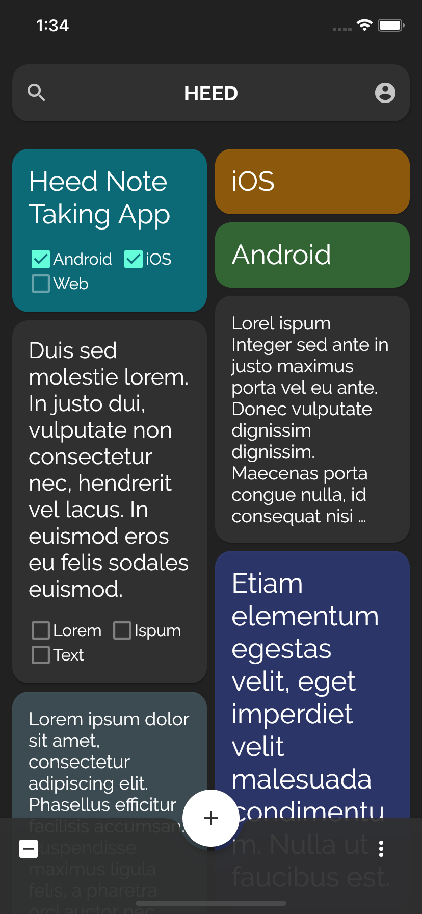
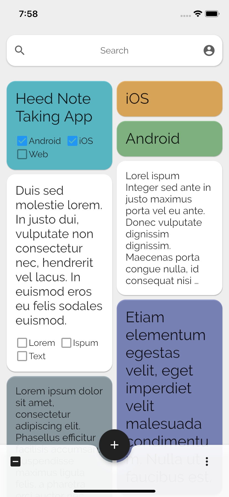
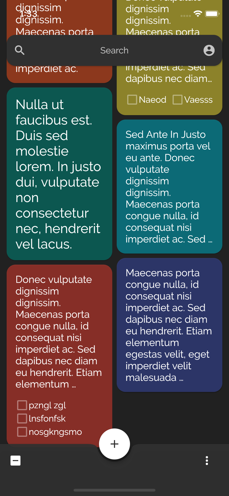
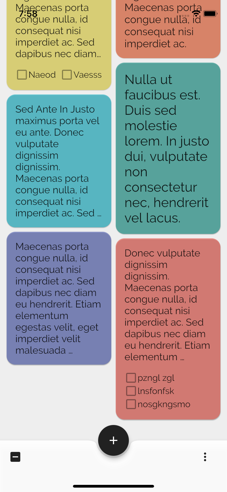
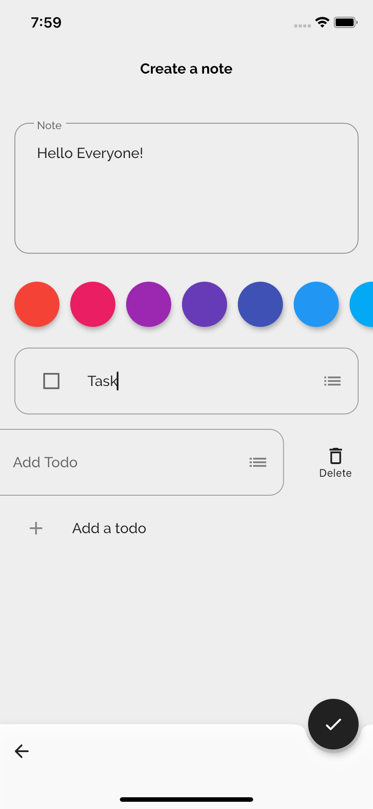
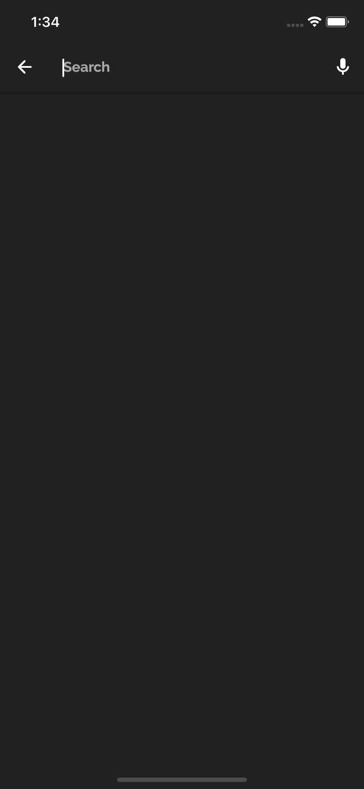
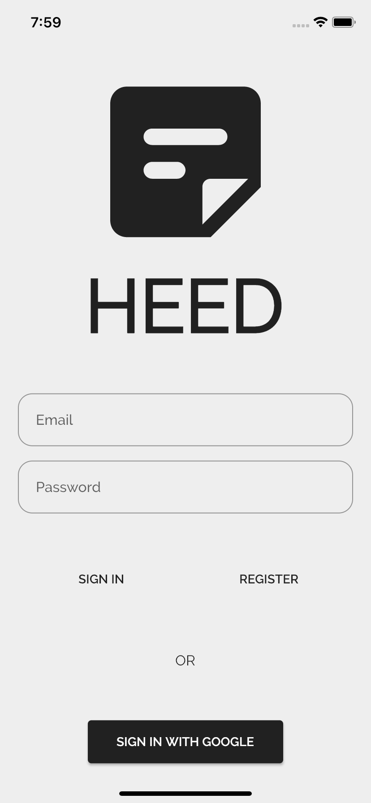

# HEED

## Note Taking App

# About

## - New UI design to [resoCoder's](https://github.com/ResoDev) Domain Driven Design - Note App
##  - Dark & Light Theme Added
## - SearchBar Added

TODO
- Implement Search
- Add color filter option
- Add Account Page
- ...

## [ResoCoder's source code](https://github.com/ResoCoder/flutter-ddd-firebase-course)

## Screenshots 

  
   

  
  
   

  
  
   

[Follow on Twitter](https://twitter.com/shakirkasmani)

## LICENSE
Source code is licensed under [BSD 3-Clause](LICENSE).